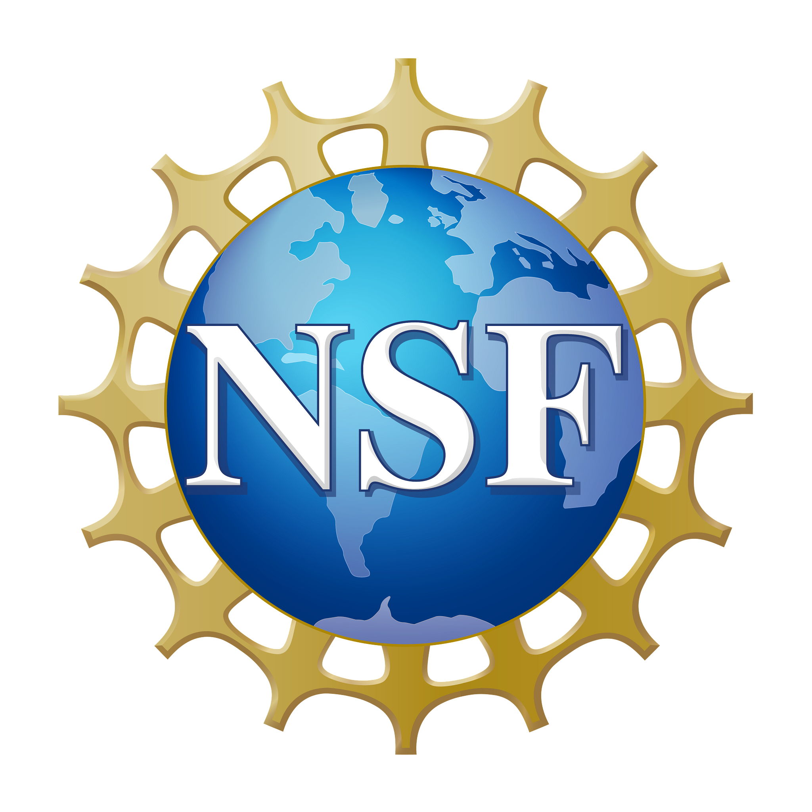

**_“Remembrance of things past is not necessarily the remembrance of things as they were.” —Marcel Proust_**

Welcome to the Computational Fluid Dynamics and Natural Hazards Lab!

As the name entails, the Computational Fluid Dynamics and Natural Hazards Lab led by Dr. Marras uses computational techniques for fluid flows to study natural hazards. For example, tropical cyclones or tsunamis. At the CFDNH Lab, we are interested in the design of efficient numerical methods for low Mach number compressible flows and the design of dynamic and minimal- dissipation sub-grid scale models for Large Eddy Simulation (LES) of very-high Reynolds number flows. 
Dr. Marras's lab has been funded by the National Science Foundation (NSF), the European Union, the New Jersey Economic Development Authority (NJEDA), and private companies, and has been featured by news outlets such as the [New York Times](https://www.nytimes.com/2020/10/29/science/remoras-suckerfish-whales.html), [Il Manifest](https://ilmanifesto.it/intelligenza-artificiale-per-prevedere-i-cambiamenti-climatici), [NewScientist](https://www.newscientist.com/article/2258565-suckerfish-use-fast-flowing-water-to-surf-across-swimming-whales-skin) and the [Smithsonian Magazine](https://www.smithsonianmag.com/innovation/ten-scientific-discoveries-2020-may-lead-new-inventions-180976616).

