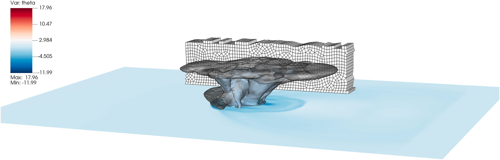
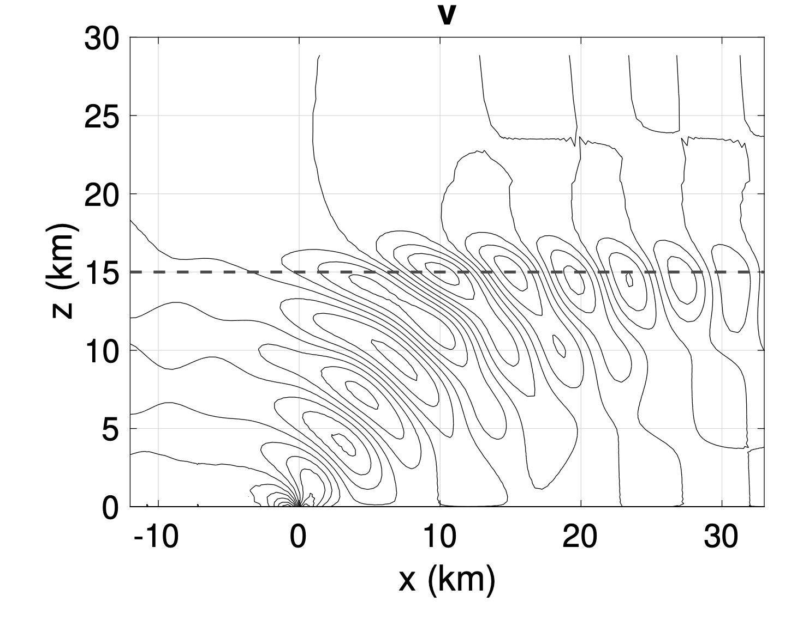

# Planetary boundary layer
Simulation of a planetary boundary layer over a flat terrain. Domain size: 10240 km X 10240 km X 3000 km. Periodic in x and y. 
Surface layer: Monin-Obukhov Similarity Theory.
SGS model: Richardson-corrected Smagorinsky. 
Effective resolution: Dx = Dy = 40 m, Dz = 31.25 m using 4th-order spectral elements.
The animation shows a bottom view of potential temperature (left), vertical velocity at z=100 m (top right), and (xz) view of potential temperature at y=5120 m (bottom right).
Simulated using [Jexpresso](https://github.com/smarras79/Jexpresso/tree/yt/wallmodel)
[//]: 

<iframe width="560" height="315" src="https://www.youtube.com/embed/Xpit9T_14AA?si=dAEsP9YEkv8ubgsO" title="YouTube video player" frameborder="0" allow="accelerometer; autoplay; clipboard-write; encrypted-media; gyroscope; picture-in-picture; web-share" referrerpolicy="strict-origin-when-cross-origin" allowfullscreen></iframe>

# Tropical cyclones at very high resolution using adaptive grids
Funded by the National Science Foundation, and in collaboration with Dr. Steve Guimond from Hampton University, we are investigating, by high-performance computing and numerical means, the fluid flow dynamics that control the rapid intensification of tropical cyclones.
The figure shows the cloud cover within a tropical cyclone simulated using adaptive mesh refinement up to LES resolution of 250 meters in the inner region of the hurricane. The 3D domain is massive, covering 800km X 800km X 30km. While the grid dimensions change as the simulation advances, the simulation at the time when this plot was created has a total of 127,000,000 grid points using spectral elements of order 4.

# Improving cloud modeling on large computers
The paper by graduate student Yassine Tissaoui investigated how vertically unstructured grids can be beneficial in the modeling of clouds on very large computers. This work sets the stepping stone towards the ability to use fully three-dimensional adaptive grids to study tropical cyclones (see project above) on exascale computers without breaking the bank when it comes to computational cost.
[Tissaoui et al.](https://agupubs.onlinelibrary.wiley.com/doi/full/10.1029/2022MS003283)

## Rendering of numerically simulated thunderstorm
The video is a Maya rendering of the storm simulated using the Nonhydrostatic Unified Model of the Atmosphere (NUMA). The rendered data come from the solution to the Navier-Stokes equations via high-order spectral elements with a dynamic subgrid scale for large eddy simulation.

Credits:
- Rendering: [Andreas Mueller](http://anmr.de/cloudwithmaya/)
- Modeling, coding, simulations: S. Marras, A. Mueller, F. X. Giraldo

# Whale simulations
This study, in collaboration with scientists from different institutions, contributed to a better understanding of why remoras attachon some very specific parts of large blue whales. All simulations were performed by Dr. Abhishek Mukherjee while he was a doctoral student at NJIT. The multi-physics software [Alya](https://www.bsc.es/research-development/research-areas/engineering-simulations/alya-high-performance-computational) from the [Barcelona Supercomputing Center (BSC)](https://www.bsc.es) was a key tool to obtain these results. The New York Times even wrote an article about this study [NY Times link](https://www.nytimes.com/2020/10/29/science/remoras-suckerfish-whales.html)! [Flammang et al. 2020](https://journals.biologists.com/jeb/article/223/20/jeb226654/226037/Remoras-pick-where-they-stick-on-blue-whales). The figure shows the structure of the turbulente flow in the proximity of the bluewhale boundary layer. The simulation, which was run on [Marenostrum IV](https://www.bsc.es/marenostrum/marenostrum) at BSC, used 40,000,000 finite elements, 80% of which were in the boundary layer alone. 
![]

# Tsunami modeling and simulation (Coastal resilience)
Communities around the world are increasingly interested in nature-based solutions to the mitigation of coastal risks by coastal forests, but it remains unclear how much protective benefits vegetation provides, particularly in the limit of highly energetic flows after tsunami impact. Abhishek Mukherjee's doctoral thesis started a long-term investigation of how much of the flow energy can be deviated or abosrbed by the presence of flexible large coastal trees. Some initial results were published in [Mukherjee et al.](https://www.sciencedirect.com/science/article/abs/pii/S0378383923000108). This work is in collaboration with Dr. Juan Carlos Cajas at the Universidad Autonoma de Mexico, en Merida, and Guillaume Houzeaux and Oriol Lehmkuhl from Barcelona Supercomputing Center. 
More work on tsunami modeling by the PI with collaborators at [Stanford University](https://www.stanford.edu) can be read in [Madden et al.](https://gmd.copernicus.org/articles/16/3479/2023/) and [Lunghino et al.](https://www.pnas.org/doi/10.1073/pnas.1911857117). I suggest to also read the review paper by [Marras and Mandli](https://www.mdpi.com/2076-3263/11/1/5)

# Open boundary conditions for compressibles flows
Mitigating the impact of waves leaving a numerical domain has been a persistent challenge in numerical modeling. Reducing wave reflection at the domain boundary is crucial for accurate simulations. Absorbing layers, while common, often incur significant computational costs. This paper introduces an efficient application of a Legendre-Laguerre basis for absorbing layers for two-dimensional non-linear compressible Euler equations. The method couples a spectral-element bounded domain with a semi-infinite region, employing a tensor product of Lagrange and scaled Laguerre basis functions. The semi-infinite region serves as an absorbing layer for our simulations. In comparison to existing methods with similar absorbing layer extensions, our approach, a pioneering application to the Euler equations, demonstrates substantial computational savings. The study marks the first application of semi-infinite elements to mitigate wave reflection in the solution of the Euler equations, particularly in nonhydrostatic atmospheric modeling. A comprehensive set of tests demonstrates the method's versatility for general systems of conservation laws, with a focus on its effectiveness in damping vertically propagating gravity waves in a linear hydrostatic mountain simulation a benchmark for atmospheric models. Across all tests, our model consistently exhibits notable performance improvements compared to a traditional Rayleigh damping approach.
[Tissaoui, Kelly, Marras (2025)](https://www.sciencedirect.com/science/article/pii/S0096300324005411)

