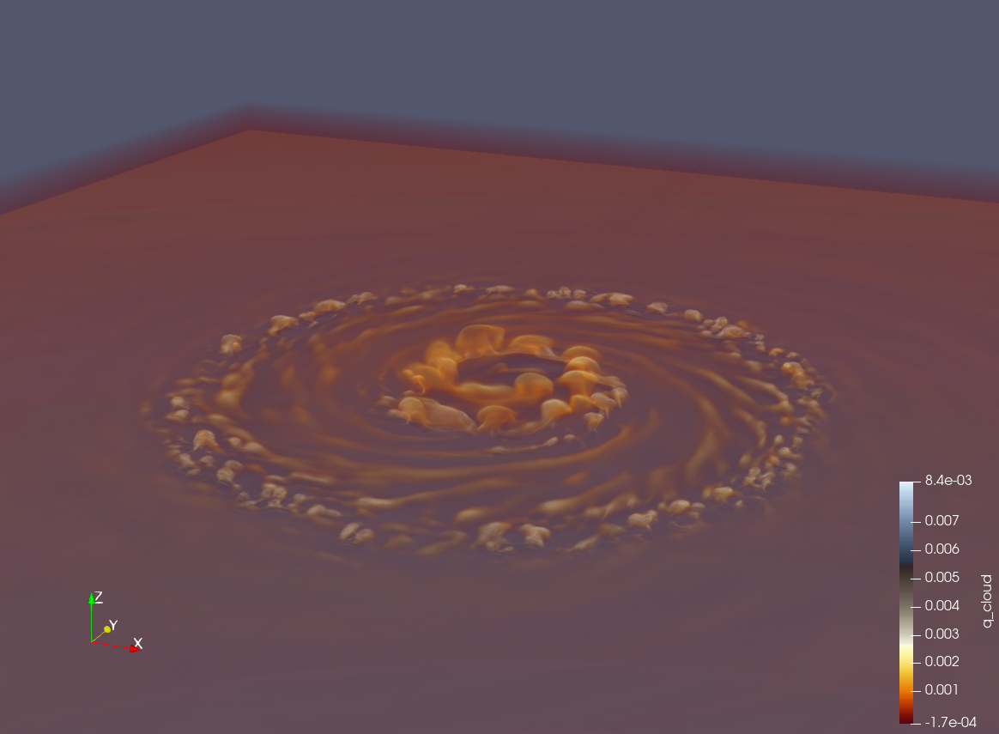
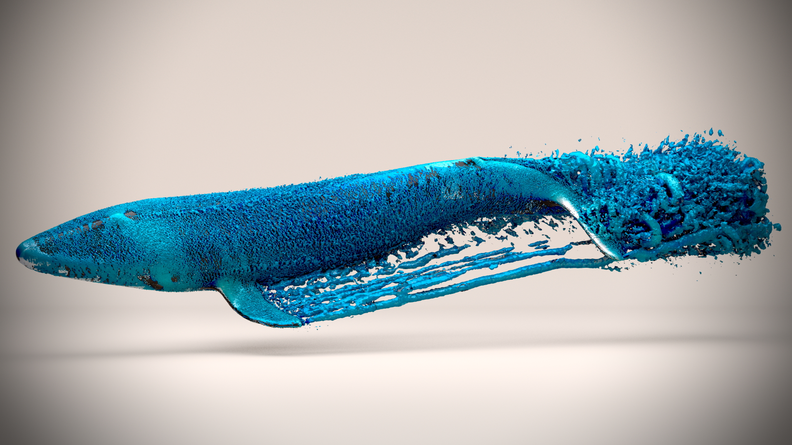

Welcome to the Computational Fluid Dynamics and Natural Hazards Lab!

As the name entails, the Computational Fluid Dynamics and Natural Hazards Lab led by Dr. Marras uses computational techniques for fluid flows to study natural hazards. For example, tropical cyclones or tsunamis. At the CFDNH Lab, we are interested in the design of efficient numerical methods for low Mach number compressible flows and the design of dynamic and minimal- dissipation sub-grid scale models for Large Eddy Simulation (LES) of very-high Reynolds number flows. 

Dr. Marras's lab is funded by the National Science Foundation (NSF), the New Jersey Economic Development Authority (NJEDA), and private companies, and has been featured by several news outlet including the New York Times.

# Whale simulations

# Tropical cyclones

  overlay_color: "#5e616c"
  overlay_image: /assets/images/mm-home-page-feature.jpg

<!-- header:
  overlay_color: "#5e616c"
  overlay_image: /assets/images/mm-home-page-feature.jpg
  actions:
    - label: "<i class='fas fa-download'></i> Install now"
      url: "/docs/quick-start-guide/"

feature_row:
  - image_path: /assets/images/LI-Logo.png
    alt: "customizable"
    title: "Super customizable"
    excerpt: "Everything from the menus, sidebars, comments, and more can be configured or set with YAML Front Matter."
    url: "/docs/configuration/"
    btn_class: "btn--primary"
    btn_label: "Learn more"
  - image_path: /assets/images/LI-Logo.png
    alt: "fully responsive"
    title: "Responsive layouts"
    excerpt: "Built with HTML5 + CSS3. All layouts are fully responsive with helpers to augment your content."
    url: "/docs/layouts/"
    btn_class: "btn--primary"
    btn_label: "Learn more"
  - image_path: /assets/images/LI-Logo.png
    alt: "100% free"
    title: "100% free"
    excerpt: "Free to use however you want under the MIT License. Clone it, fork it, customize it... whatever!"
    url: "/docs/license/"
  btn_class: "btn--primary"
 btn_label: "Learn more"  -->
